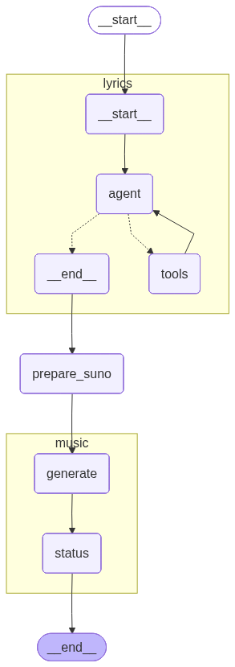
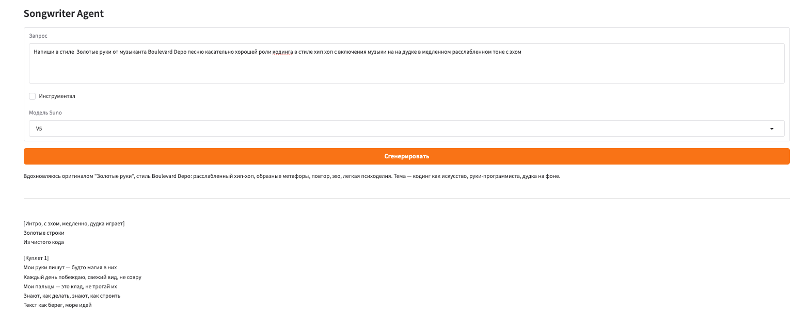
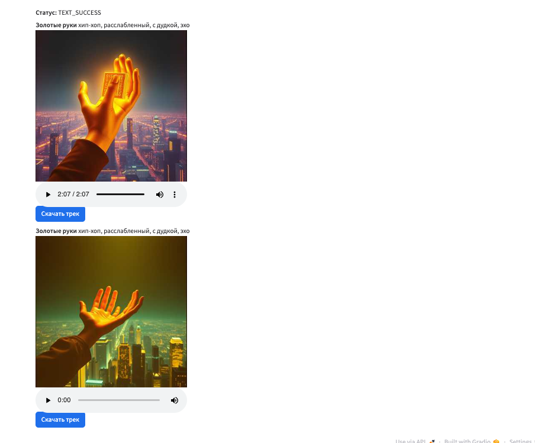

# Songwriter Agent - Генератор музыки на основе AI

Автоматизированная система для генерации текстов песен и создания музыкальных композиций с использованием искусственного интеллекта. Проект построен на основе LangGraph workflow и интегрирован с Suno AI для создания музыки.

## 🚧 Стадии разработки

- [x] Lab 1
- [ ] Lab 2
- [ ] Lab 3


## 🎵 Что это такое?

Это агент-система, которая:
1. **Генерирует тексты песен** на основе вашего запроса с использованием LLM 
2. **Предоставляет инструменты** для поиска текстов песен (например, поиск в Genius) и RAG (`SOON: LAB 2`)
2. **Создаёт музыкальные композиции** с помощью Suno AI API
3. **Предоставляет удобный веб-интерфейс** для взаимодействия с системой... с натяжкой для stateful приложения gradio в одной сессии... ну ок пусть будет так)))

Вы просто описываете, какую песню хотите получить (стиль, тему, исполнителя), и система создаёт для вас готовую композицию!

## 🏗️ Архитектура системы

Проект построен на основе **LangGraph** - библиотеки для создания агентских workflow. Система работает в несколько этапов:

```
Запрос пользователя (+ SO) → Генерация текста (LLM + инструменты - aka ReAct) → Подготовка запроса (+ SO)→ Генерация музыки → Результат
```

### Визуализация workflow

Полная схема работы системы представлена на диаграмме:



**Основные этапы:**

1. **Lyrics Generation (Генерация текста)** - LLM-агент создаёт текст песни на основе вашего запроса
2. **Prepare Suno (Подготовка запроса)** - Система подготавливает параметры для Suno AI API
3. **Music Generation (Генерация музыки)** - Suno AI создаёт музыкальную композицию с вокалом

## 📦 Установка и запуск

### Требования

- Python >= 3.13
- UV package manager (рекомендуется) или pip

### Установка зависимостей

```bash
# С использованием UV
uv sync
```

### Настройка переменных окружения

Создайте файл `.env` в корне проекта со следующими переменными:

```env
# API ключ для Suno AI
SUNO_API_KEY=your_suno_api_key_here

# API ключ для OpenAI (для генерации текстов)
OPENAI_API_KEY=your_openai_api_key_here

# API ключ для Genius (для работы с текстами песен)
GENIUS_ACCESS_TOKEN=your_genius_token_here
```

### Запуск приложения

```bash
# Запуск веб-интерфейса
python src/app.py
```

После запуска откройте браузер и перейдите по адресу, который будет показан в консоли (обычно `http://127.0.0.1:7860`).

## 🎨 Пользовательский интерфейс

Веб-интерфейс построен на **Gradio** и предоставляет простой и интуитивный способ взаимодействия с системой.

### Основной экран



### Экран с результатами



### Элементы интерфейса:

- **Поле "Запрос"** - здесь вы вводите описание желаемой песни
- **Чекбокс "Инструментал"** - включите, если нужна только музыка без вокала
- **Выпадающий список "Модель Suno"** - выбор версии модели Suno AI (V5, V4_5PLUS, V4_5, V4, V3_5)
- **Кнопка "Сгенерировать"** - запускает процесс создания песни
- **Область "Текст песни"** - здесь отображается сгенерированный текст
- **Область "Треки"** - здесь отображаются созданные музыкальные композиции с возможностью прослушивания и скачивания

## 📝 Примеры использования

### Пример 1: Реп-трек про университет ИТМО

**Запрос:**
```
Напиши в стиле Dragonborn от музыканта Big Baby Tape песню касательно университета ИТМО стиль реп,треп и 808
```

**Результат:** [song_example_1.mp3](docs/song_example_1.mp3)

В этом примере система создала реп-композицию в стиле Big Baby Tape с упоминанием университета ИТМО, используя характерные для трепа и репа 808-биты.

### Пример 2: Хип-хоп про кодинг с этническими элементами

**Запрос:**
```
Напиши в стиле Золотые руки от музыканта Boulevard Depo песню касательно хорошей роли кодинга в стиле хип хоп с включения музыки на на дудке в медленном расслабленном тоне с эхом
```

**Результат:** [song_example_2.mp3](docs/song_example_2.mp3)

Здесь система создала медленную хип-хоп композицию в стиле Boulevard Depo с этническими элементами (дудка), посвящённую программированию, с эффектом эха для создания атмосферы.

## 🛠️ Технологии и библиотеки

### Основные технологии:

- **LangGraph** - создание агентских workflow и управление состоянием
- **LangChain** - работа с LLM и инструментами
- **Gradio** - создание веб-интерфейса
- **Suno AI API** - генерация музыки
- **OpenAI API** - генерация текстов песен
- **LyricsGenius API** - работа с базой текстов песен Genius.com

### Полный список зависимостей:

См. файл `pyproject.toml` для полного списка зависимостей и их версий.

## 📁 Структура проекта

```
lab1/
├── src/                    # Основной код проекта
│   ├── app.py             # Точка входа, веб-интерфейс на Gradio
│   ├── conf/              # Конфигурация проекта
│   │   └── settings.py    # Настройки и переменные окружения
│   ├── core/              # Бизнес-логика и доменные сущности
│   │   ├── domains.py     # Доменные модели (UserQuery, SunoRequest и т.д.)
│   │   ├── llm_factory.py # Фабрика для создания LLM
│   │   ├── lyrics.py      # Логика работы с текстами песен
│   │   ├── suno_client.py # Клиент для работы с Suno AI API
│   │   ├── suno_prepare.py # Подготовка запросов к Suno
│   │   ├── suno_render.py # Рендеринг результатов Suno
│   │   ├── suno_view.py   # Представление данных Suno
│   │   └── utils.py       # Вспомогательные утилиты
│   ├── workflow/          # Workflow и графы LangGraph
│   │   ├── app_graph.py   # Главный граф приложения
│   │   ├── lyrics_graph.py # Граф генерации текстов
│   │   ├── music_graph.py  # Граф генерации музыки
│   │   ├── lyrics_nodes.py # Узлы для генерации текстов
│   │   ├── music_nodes.py  # Узлы для генерации музыки
│   │   ├── prepare_suno.py # Подготовка запросов к Suno
│   │   ├── prompts.py      # Промпты для LLM
│   │   ├── state.py        # Состояния для workflow
│   │   └── tools.py        # Инструменты для агентов
│   └── logger/            # Логирование
│       └── logger.py      # Настройка логирования
├── docs/                  # Документация и примеры
│   ├── graph.png         # Диаграмма workflow
│   ├── ui_form_1.png     # Скриншот интерфейса 1
│   ├── ui_form_2.png     # Скриншот интерфейса 2
│   ├── song_example_1.mp3 # Пример результата 1
│   └── song_example_2.mp3 # Пример результата 2
├── pyproject.toml        # Конфигурация проекта и зависимости
└── README.md             # Этот файл
```

## 🔄 Как это работает?

1. **Пользователь вводит запрос** через веб-интерфейс
2. **Lyrics Graph** обрабатывает запрос с помощью LLM-агента, который:
   - Анализирует запрос
   - Использует инструменты (например, поиск в Genius) при необходимости
   - Генерирует текст песни
3. **Prepare Suno** извлекает из текста:
   - Название песни
   - Стиль музыки
   - Промпт для Suno AI
4. **Music Graph** отправляет запрос в Suno AI и:
   - Создаёт задачу на генерацию музыки
   - Отслеживает статус выполнения
   - Получает готовые треки
5. **Результат** отображается пользователю с возможностью прослушивания и скачивания

## 💡 Советы по использованию

- **Будьте конкретны** в описании желаемого стиля и темы
- **Указывайте исполнителей** для более точного стиля
- **Экспериментируйте** с разными моделями Suno для разных результатов
- **Используйте инструментал**, если хотите только музыку без вокала

## 📄 Лицензия

Этот проект создан в учебных целях.

## 🤝 Вклад

Проект создан в рамках лабораторной работы по курсу LLM.

---

